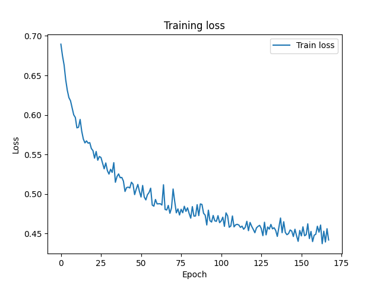
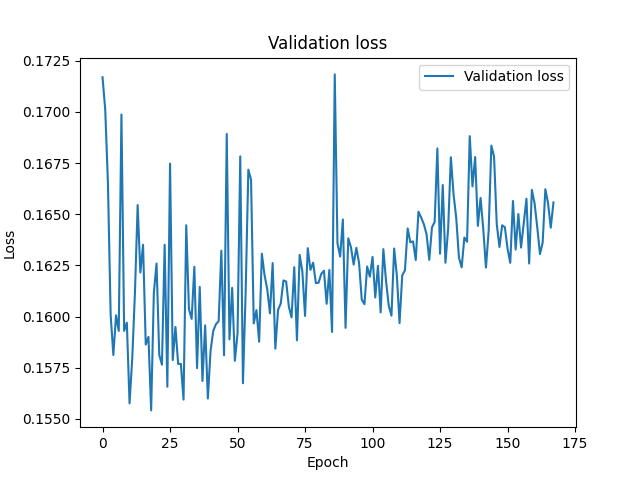

# Detection of Alzheimer's Disease with a Vision Transformer on the ADNI Dataset

## Background
Transformers have typically seen success in natural language processing tasks, however, with the research performed in the paper ["An Image is worth 16x16 words"](https://arxiv.org/abs/2010.11929), it can be seen that transformers also have the potential to be used in computer vision and image processing tasks.

Transformers are deep learning models which break the input data into "tokens" which in the case of text are small chunks of characters which are frequently seen together, but in the case of images, are small "patches" of pixels which are positioned close together. These tokens are fed into the encoder layer of the transformer which extracts the relationships between the tokens, and the decoder layer of the transformer which generates the output.

Transformers form a more generalised model compared to traditional CNNs, since the usage of patch embeddings allows the model to __**learn**__ the relationships (or attention) between the tokens, without introducing biases (In the case of CNNs, this involves spatial biases from the kernel - which groups pixels within the kernel's range as "areas of interest"). This allows the model to be applied to a wider range of tasks, such as image classification, object detection, and image segmentation.

While transformers typically require large datasets to be able to overcome the lack of biases, augmentations can be applied to "generate" new images, and current image datasets have grown to a size which makes transformers possible to train. This project aims to apply transformers to the ADNI dataset, which is a dataset of MRI scans of patients with Alzheimer's Disease, and patients without Alzheimer's Disease.

## Architecture
The vision transformer (ViT) is composed of a a few key components, namely - the patch embedding, position embedding, a transformer encoder layer, and a transformer decoder layer. The patch embedding layer takes in the input image and breaks it into patches of pixels, which are then flattened into a 2D matrix. This matrix is then fed into the transformer encoder layer which extracts the relationships between the patches, and the transformer decoder layer which generates the output. The output is then fed into a linear layer which outputs the classification of the image.

## Preprocessing
The data was first loaded into the program using a custom function which parsed all images in a list of directories, labeled based on directory, and split the training directories into a train and validation set with an 80:20 split. The test directories were also parsed with the same function. These loaded images and labels were then loaded into a custom torch dataset which performed the specified preprocessing to the data, before finally being put into a dataloader to be used in the future.

Upon reviewing the images, it was found that each image contained a lot of blank space, and the brain only made up the center section of it. This meant that if the raw image was used, the model would have to process an unnecessarily large image which would cause it to be larger and have to unnecessary relationships between the blank space and the brain. To improve the runtime and space complexity, a center crop was performed to resize the image to 192x192, however, it was later found that some brains were truncated by this crop and the image was cropped to 224x224 instead.

While this was the only preprocessing performed during the first few iterations of training, it was found that the model was unable to exceed a test accuracy of 60%. To attempt to remedy this, the mean and standard deviations of the training set was calculated, and used to normalised the training, validation, and test sets.

## Training
At first, I had tried to implement the [Medium](https://medium.com/mlearning-ai/vision-transformers-from-scratch-pytorch-a-step-by-step-guide-96c3313c2e0c) tutorial which built all the vision transformer components manually, however, upon training with the model developed in this tutorial, I found that the model was prone to overfitting (Refer to the Validation Accuracy Graph Below - validation accuracy begins to drop after 25 epochs) due to the lack of dropout layers and the model was also quite slow to train (~15 mins per epoch even on a smaller model). The best accuracy I was able to achieve with this model was 67% on the validation set, and 59% on the test set which was not very good.

The validation accuracy graph above also showed that the learning rate of the training was too high as the model was oscillating and struggling to converge. I thus decided to use the [LearnPytorch](https://www.learnpytorch.io/08_pytorch_paper_replicating/#44-flattening-the-patch-embedding-with-torchnnflatten) tutorial which again implemented the model's layers from scratch, however, I made improvements on the model by using the torch.nn.TransformerEncoderLayer instead of the custom model used in the tutorial - this improved the efficiency of the model and increased the training speed by almost 10x compared to the Medium tutorial for the same model size. This model had the added benefit of having dropout layers which reduced the overfitting. The best accuracy I was able to achieve with this model was 73% on the validation set, and 61% on the test set which was a slight improvement over the Medium tutorial.

### Parameters

## Results
Below are graphs for the training and validation loss of the initial model 

This model achieved a test accuracy of

After performing a parameter search, I arrived on my best model

## Running the code

### Dependencies